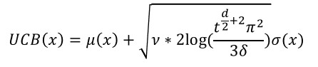
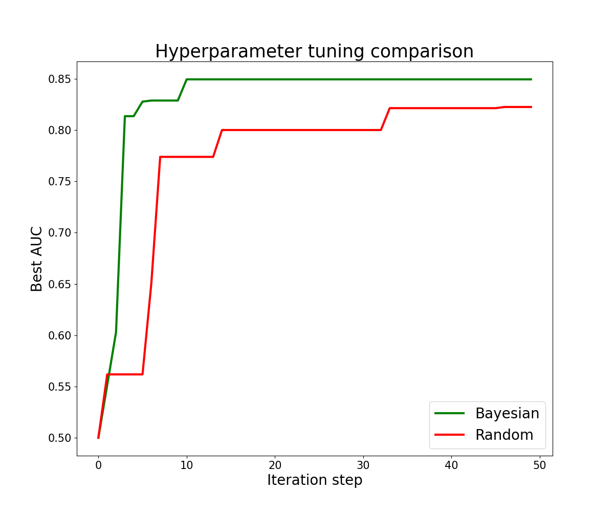

# spark-hpopt: Bayesian Hyperparameter Optimization for Apache Spark

This framework provides an algorithm for Bayesian optimization for hyperparameters in machine learning models. The algorithm is based on [_A Tutorial on Bayesian Optimization of Expensive Cost Functions, with Application to Active User Modeling and Hierarchical Reinforcement Learning_][paper] by Eric Brochu, Vlad M. Cora and Nando de Freitas. This paper is recommended to retrieve a general understanding of the topic.

For Python, there are packages like [BayesianOptimization](https://github.com/fmfn/BayesianOptimization) and [hyperopt](https://github.com/hyperopt/hyperopt), this framework intends to fill the gap for Apache Spark in scala.


## Table of content
- [How to use](#how-to-use)
- [Code Examples](#code-examples)
- [Run the Notebooks with docker-stacks](#run-the-notebooks-with-docker-stacks)
- [The Algorithm](#the-algorithm)
- [Benchmark](#benchmark)


## How to use
The entry point will always be your own instance of [BayesianHyperparameterOptimization](hpopt/src/main/scala/com/agoda/ml/spark/hpopt/BayesianHyperparameterOptimization.scala). You provide it with a [HyperparameterSpace](hpopt/src/main/scala/com/agoda/ml/spark/hpopt/hyperparam/HyperparameterSpace.scala), that determines the tunable hyperparameters including their range and scale, and some additional options if you want. Checkout the [code examples](#code-examples), [notebooks](notebooks) and documentation for further information.


## Code Examples
Let's take a look at some code examples from the [Titanic notebook](notebooks/BayesianOptimizationTitanicExample.ipynb).

We just import the whole package:
```scala
import com.agoda.ml.spark.hpopt.BayesianHyperparameterOptimization
import com.agoda.ml.spark.hpopt.hyperparam._
import com.agoda.ml.spark.hpopt.gaussian._
```
We use sparks `RandomForestClassifier`
```scala
import org.apache.spark.ml.classification.RandomForestClassifier
val rawClassifier = new RandomForestClassifier("rf")
        .setSeed(20201124L)
        .setFeaturesCol("features")
        .setLabelCol("survived")
        .setProbabilityCol("survival_prob")
        .setRawPredictionCol("survival_raw_pred")
```
and want to tune *impurity*, *maxDepth*, *numTrees* and *minInfoGain*:
```scala
val hpSpace = HyperparameterSpace(Array(
    CategoricalHyperparameterType("impurity", Seq("entropy", "gini")),
    IntHyperparameterType("maxDepth", LinearScale(2, 10)),
    IntHyperparameterType("numTrees", LogScale(3, 20)),
    DoubleHyperparameterType("minInfoGain", LinearScale(0, 0.3))
))
```
Now, we only have to instantiate
```scala
val bho = new BayesianHyperparameterOptimization(
    hpSpace,
    seed = Some(24112020),
    maximize = true
)
```
using default values for all parameters. If we want to set the parameters individually the code would look more like this:
```scala
val bho = new BayesianHyperparameterOptimization(
    hpSpace,
    seed = Some(24112020),
    gpf = GaussianProcessFactory(kernel = SEKernel(lengthScale = 0.5)),
    acquisitionFct = UCB(delta = 1d, nu = 4d),
    monteCarloSteps = 10000,
    maximize = true
)
``` 
You can refer to the [algorithm description](#the-algorithm) to get an understanding of the parameters. Iterating over the evaluation steps is up to the user, the framework will be used to obtain the next hyperparameters (`HyperparameterEvalPoint`) to be evaluated by calling `BayesianHyperparameterOptimization.getNextRandom` or `BayesianHyperparameterOptimization.getNext`. You can update your `PipelineStage` with the new hyperparameters by using the provided methods:
```scala
val nextHP: HyperparameterEvalPoint = bho.getNextRandom
val classifier: RandomForestClassifier = hp.copyPipelineStage(rawClassifier) match {
    case rfc: RandomForestClassifier => rfc
}
```
In order to retrieve a `DataFrame` with all iterations steps, you can use `HyperparameterSpace.createDF`.


## Run the Notebooks with docker-stacks
You can run the [notebooks](notebooks) yourself, using a docker image with Jupyter, Apache Spark and a spylon kernel for scala provided by <https://github.com/jupyter/docker-stacks>. You can see in [docker-compose.yml](docker-compose.yml), that we fixed the image tag of the pulled image. You can try to change the image tage to `latest` or another more recent tag.

In order to run a container with Spark 2.4.7 and scala 2.11 (that's what the spylon kernel is built for) you need to take the following steps. If not said otherwise, run the commands in the main folder of this project.
   
1. Run `sbt "project hpopt_sparkutil" "assembly"`
   
   This will create a fat jar and saves it as `hpopt_sparkutil/target/scala-2.11/assembly.jar`. Later this jar will be copied to the docker image and loaded into the Jupyter notebook in order to use the package.
   
2. Create a folder `notebooks_from_container` in the main folder of this project. Copy the notebooks from [notebooks](notebooks) into this folder. This folder will later be mirrored as a volume inside the docker image.

3. Run `git clone https://github.com/jupyter/docker-stacks` in the parent folder of this project. (Latest commit that was checked and worked was `commit 703d8b2dcb886be2fe5aa4660a48fbcef647e7aa`. If you are facing problems you might want to try with this commit.)

   If this repository is in the same parent folder as the spark-hpopt project, you won't have to change the paths to the Dockerfiles in [docker-compose.yml](docker-compose.yml).
   
4. Run `docker-compose build`
   
    This command will trigger the build of several docker images build on top of each other defined in [docker-compose.yml](docker-compose.yml) and under the usage of [minimal.dockerfile](minimal.dockerfile) and [Dockerfile](Dockerfile).
5. Run `docker-compose up hpopt_notebook`

    Finally, runs the container. You should now be able to access Jupyter by using the link <http://127.0.0.1:8888>. We can access the Spark UI for up to 3 jobs using the ports 4040, 4041 and 4042. If that's not enough for you, you can expose more ports.

Done! You will find the notebooks in the folder [hpopt_notebooks](http://127.0.0.1:8888/tree/hpopt_notebooks) and be able to run them using the spylon kernel.


## The Algorithm
For detailed information we refer to the [paper][paper] mentioned above.

We assume each possible value setting of hyperparameters is an element in the same Gaussian process. That means each sequence of metric evaluations (we actually use scaled metrics) follows the multivariate Gaussian distribution with some mean vector  and a covariance matrix . We further assume that  and the covariance between two evaluations is determined by some kernel function , which depends on the "distance" the two hyperparameter value combinations  and  have to each other.


### Distance between 2 hyperparameter value combinations
For each single hyperparameter we can calculate the distance or residual between two values. This depends on the hyperparameter type:
- *categorical*: If the values are the same 0, else 1 (or some other default value)
- *boolean*: Same as categorical
- *numerical* (with scale): Use the real distance between the 2 values by applying the scale (linear or logarithmic with maximum residual value)

After calculating these distances component-wise, we end up with a residual vector. Depending on the used kernel function we can retrieve a scalar distance from this residual vector by applying the euclidean norm. Working with scales and inputs that are not numerical is an enhancement to the source paper.


### Kernel function
The default kernel function is the squared exponential kernel , where *dist* is the scalar distance between two hyperparameter value combinations and  is a length scale parameter, that defaults to 0.5 in our code.


### Exploitation-Exploration Trade-Off
After some iterations of evaluating random hyperparameter value combinations we can construct the Gaussian process as described above. For each possible new value combination we can calculate the expectation and the variance of the resulting metric. We use these two values to find the optimal next value combination. A good spot to mention the exploitation-exploration trade-off: Optimizing the expectation means exploiting while evaluating hyperparameters with great variance results in exploring.


### Optimize the acquisition function
We try to optimize the upper-confidence-bound acquisition function

.

*d* is the dimension (number of tunable hyperparameters), *t* is the iteration count,  and  can be altered by the user to adjust exploitation-exploration behavior.

In order to optimize the acquisition function we evaluate it multiple times (default: 10 000) and use the hyperparameter value combination that results in the optimal value to evaluate the real metric value.


### Independence to metric range
Different to the source paper, we linearly scale the metric values to the minimal value -0.5 and the maximum value 0.5. Therefore, our algorithm and the set default parameters are independent to the range of the metric values.


## Benchmark
In the [Titanic notebook](notebooks/BayesianOptimizationTitanicExample.ipynb) we compare 50 iterations of our algorithm (including 5 random iterations to start with) to 50 iterations of random hyperparameter tuning. Of course, this is not a significant experiment, but our algorithm seems to converge faster and provides the better result in the end.




[paper]: https://arxiv.org/abs/1012.2599
